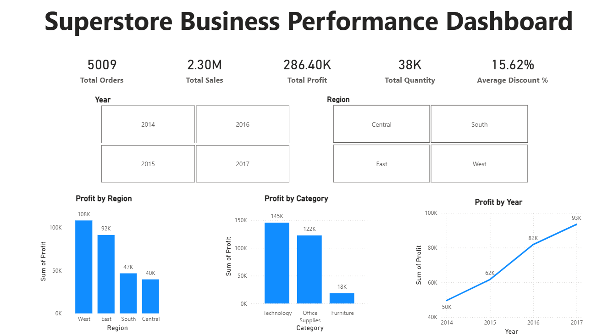
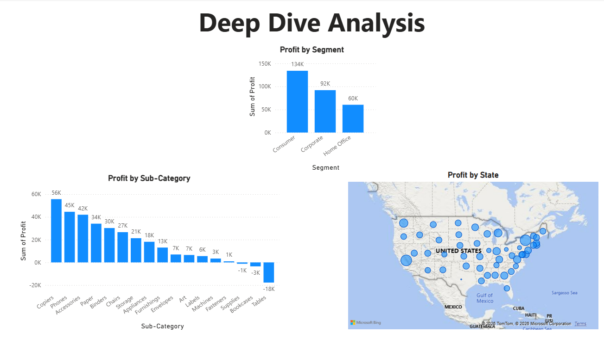

# Superstore Business Performance Analysis

End-to-end business analysis of 9,994 retail orders using SQL, Python, and Power BI to identify profit drivers, underperforming segments, and operational inefficiencies.

**Analyst:** Amit Govind | **Tools:** SQLite · Python · Power BI | **Dataset:** Sample Superstore (2014–2017)

---

## Key Findings

- **Central region** generates $501K in sales but only 7.92% profit margin — a structural margin problem, not a volume problem
- **Tables sub-category** posts -$17.7K profit despite $206K in sales — driven by high shipping and handling costs, not discounting alone
- **Furniture category** averages 17.39% discount yet delivers only 2.49% margin, while Technology maintains 17.4% margin at lower discounts
- **Texas, Ohio, and Illinois** are losing money at scale — high order volume states with negative margins requiring product mix investigation
- **Profit grew from $49.5K (2014) to $93.4K (2017)** but margin peaked in 2016, signalling a sustainability question heading into 2018

---

## Dashboard Preview

---

## Project Structure

| Folder | Contents |
|--------|----------|
| `sql/` | SQL queries (SQLite) |
| `python/` | Jupyter notebook with EDA + Claude API integration |
| `outputs/` | Charts, AI-generated executive summaries |
| `dashboard/` | Power BI file + dashboard screenshots |
| `presentation/` | Full SQL analysis documentation |

---

## Tools & Skills Demonstrated

- **SQL** — aggregations, GROUP BY, HAVING, SUBSTR for date parsing, margin calculations
- **Python** — pandas EDA, matplotlib/seaborn visualisation, feature engineering (Days to Ship), Claude API integration for automated executive summaries
- **Power BI** — interactive dashboard, DAX measures, slicers, map visualisation
